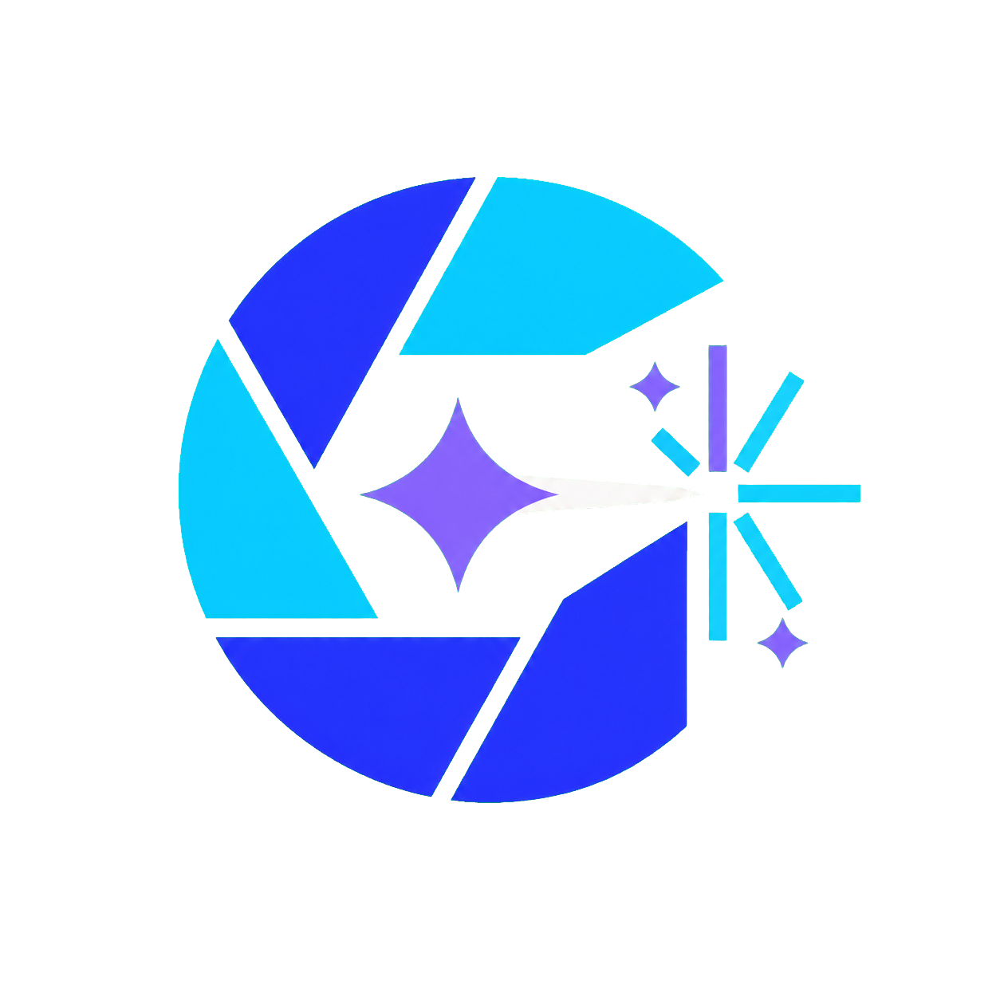

# 光构 · Gouo Canvas

> 把灵感构造成图像。

光构是由 **xgouo** 设计的 AI 图片生成与编辑平台，面向需要文生图、参考图编辑、局部重绘和多轮创作的用户。



## 当前状态

当前仓库已完成第一阶段品牌化，现有图片生成、参考图、遮罩编辑、画廊、收藏夹和 Agent 功能可继续使用。

仓库现已接入 One Hub 后端底座，完成登录、注册、用户专属中继令牌和统一 API 转发主链路。额度账本、充值订单、支付回调和管理后台由后端提供；用户中心与充值页面仍需继续做光构风格的前端接入。

## 文档

- [用户使用指南](./docs/USER_GUIDE.md)
- [SaaS 架构与实施计划](./docs/SAAS_ARCHITECTURE.md)
- [后端接入与部署](./docs/BACKEND_INTEGRATION.md)
- [原项目自定义服务商说明](./docs/custom-provider-llm-prompt.md)

## 本地开发

```bash
npm install
npm run dev
```

生产构建与测试：

```bash
npm run build
npm test
```

## 安全边界

- 前端不保存平台统一 API Key。
- 生图请求必须经过服务端身份验证、额度预扣和限流。
- 支付结果只信任支付平台签名回调，不信任前端跳转参数。
- 额度变动通过不可变账本记录，不直接覆盖用户余额。

## 开源声明

本项目基于 [GPT Image Playground](https://github.com/CookSleep/gpt_image_playground) 修改，原作者为 [CookSleep](https://github.com/CookSleep)，依照 MIT License 使用和再发布。原始版权与许可文本见 [LICENSE](./LICENSE)。
