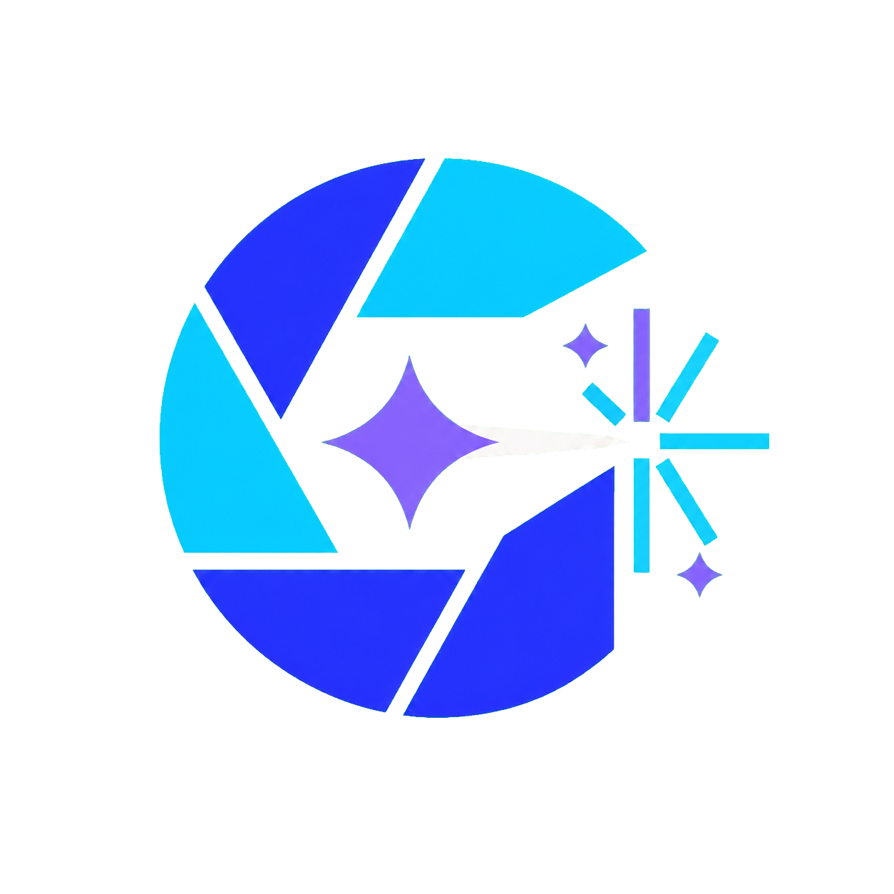
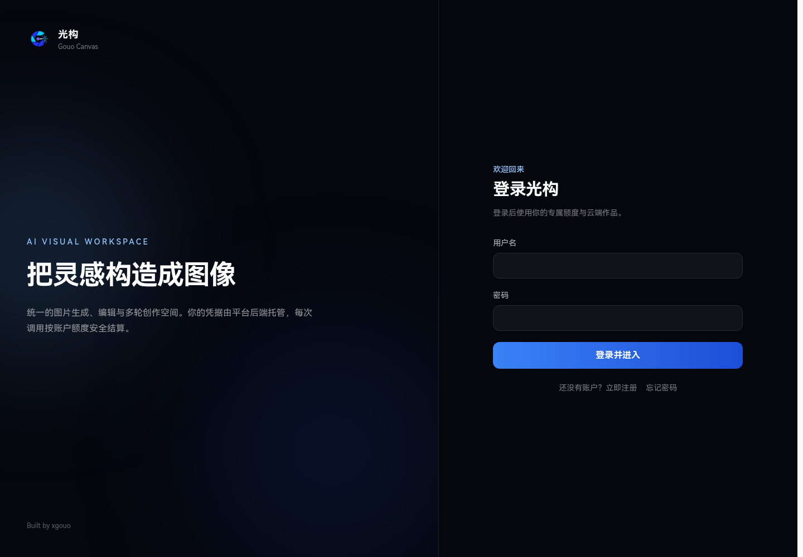

# Gouo Canvas

[简体中文](./README.zh-CN.md) · **English** · [Documentation](./docs/README.md)

An AI image workspace for generation, reference-image and masked editing, and library management. Built with React and a Go backend derived from One Hub. Accounts, balances, and cloud libraries are managed by the backend; platform API keys stay on the server.



[Live demo](https://canvas.wcnmb.top/) — an account is required; image generation uses your balance.

## Preview

Public sign-in page, captured on 2026-09-30. No private account data is shown.



## Run locally

Requires Node.js 22, npm, Git, and Go 1.25. The commands below use PowerShell, starting at the repository root.

Start the backend (SQLite by default; Redis is optional locally):

```powershell
Set-Location server
$env:SESSION_SECRET = '<at-least-32-random-characters>'
$env:USER_TOKEN_SECRET = '<a-different-at-least-32-character-secret>'
go run .
```

In a second terminal at the repository root:

```powershell
Copy-Item .env.example .env.local
npm install
npm run dev
```

Open `http://127.0.0.1:5173`. Vite proxies `/api`, `/v1`, and `/panel` to `VITE_GOUO_BACKEND_DEV_TARGET` (default: `http://127.0.0.1:3000`).

An empty database creates `root` / `123456`. **Change this password immediately, before exposing the service.** In `http://127.0.0.1:3000/panel`, configure an image channel and its upstream API key, matching `VITE_GOUO_IMAGE_MODEL`. Generation needs a working channel and account balance.

See the [development guide](./docs/en/development.md) for full setup, frontend-only mode, and frontend variables. Backend settings, cloud storage limits, and backups are in the [backend guide](./docs/en/backend.md); environment examples are in [`.env.example`](./.env.example) and [`deploy/.env.example`](./deploy/.env.example).

## Checks

```powershell
npm run build
npm test

# Backend smoke checks, from server/
Set-Location server
go test ./controller -run '^$'
go test ./relay/relay_util -run '^TestGetFixedImageQuota$'
```

## Deploy

Use one public origin: serve the frontend and proxy `/api` and `/v1` to the backend. Configure upstream keys only in the backend admin panel.

Choose [Docker Compose](./docs/en/deployment/docker.md) or [manual Linux deployment](./docs/en/deployment/manual.md). Read the [deployment overview](./docs/en/deployment/index.md) and complete the [production checklist](./docs/en/deployment/checklist.md) before opening registration or payments.

- Keep session and relay-token secrets stable and private. Never commit real environment files, credentials, databases, logs, or private keys.
- In product mode, unsynchronized work may exist only in the browser; IndexedDB is a cache, not a backup. In frontend-only mode, data stays in the browser unless the provider stores request data.
- The local asset directory supports one backend instance. Multiple instances need shared storage.
- Fixed user pricing is separate from upstream cost. Validate costs for each model, quality, size, and edit type. Payments need a configured provider, verified callbacks, public pricing and refund terms, and reconciliation; use redemption codes until this is ready.

## More documentation

[User guide](./docs/en/user-guide.md) · [Testing and mock API](./docs/en/testing.md) · [Changelog](./CHANGELOG.md)

`server/docs/` belongs to upstream One Hub; use the Gouo deployment guides linked above for this project.

## License

The frontend is derived from [GPT Image Playground](https://github.com/CookSleep/gpt_image_playground) under MIT. The backend is derived from [One Hub](https://github.com/MartialBE/one-hub) under Apache-2.0, with its original notices retained. See [LICENSE](./LICENSE) and the license files in `server/`.
