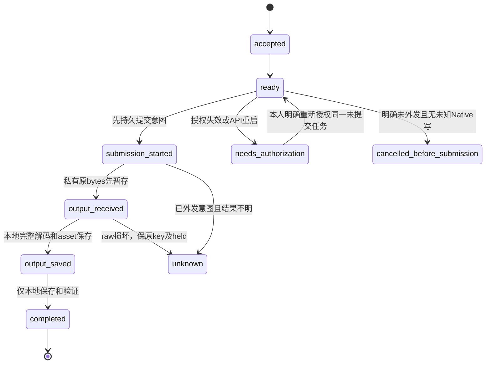

# B3 持久图片任务：授权与恢复方案

2026-10-02，系统分支已实现并合同验证B3-I及B3.3的图片解码前暂存。默认关闭，同API进程内存授权执行；尚未接入前端或完成Native202任务实测。独立Worker与持久后台授权仍未完成，以下分别区分当前合同与后续方案。

## 当前 B3-I 接口

`GOUO_ENABLE_IMAGE_JOBS=false`默认关闭受理和重新授权；`GOUO_MAX_IMAGE_JOBS=2`限制全实例活跃任务，允许1–16。原结果GET、确定外发前取消和已保存输出的本地完成不依赖生成开关。同期每owner只能有一个活跃操作，复用同步生成/资料/领取/续用守卫；模型提交未知只锁原key，未知Native写则锁全owner。

| 路由 | 当前行为 |
| --- | --- |
| `POST /api/studio/image-jobs` | UUID Idempotency-Key；保存不可变参数、模型批准版本、付款意图和通知意图后202。重复同参数返回原任务，不新生成；漂移或原unknown/needs_authorization/cancelled返回409。 |
| `GET /api/studio/image-jobs/:id` | 仅本人、private/no-store；真实状态；completed可返回已保存原图与保守费用。 |
| `POST /api/studio/image-jobs/:id/authorize` | body仅`{"confirm":true}`；只允许确定未提交的needs_authorization，重新核验原参数/组/模型/付款来源，202后执行同一任务。 |
| `POST /api/studio/image-jobs/:id/cancel` | body仅`{"confirm":true}`；需要无模型提交、无本次试用预留、无未知Native写证据；只释放新业务占用。 |
| `POST /api/studio/image-jobs/:id/finalize` | 仅output_received/output_saved；核验本人原图hash、完整解码及元数据，本地事务完成，不再次调用模型。 |

新增image_jobs/image_job_reservations/image_job_outbox保存业务状态，不保存账号Bearer/relay key/Cookie或自建金额。接收和提交屏障各自使用SQLite事务；提交前trial reserve与唯一model_submissions同事务。进程重启明确区分未提交需授权、已提交未知、已保存原图本地完成。image_job_staging在有界HTTP JSON读取和规范base64转换后、第一次Sharp metadata之前保存私有原bytes/hash及output_received；验证成功后原bytes与output_saved同事务写asset，核验完全一致后才删除暂存。HTTP不完整/JSON错误/暂存未提交仍unknown，不能本地恢复尚未取得的原图。

暂存30MiB原bytes/40MiB编码，HTTP JSON实际读上限48MiB；GET在完整验证前不发布raw，继续拒绝binary和URL-only，不增加URL下载。损坏hash/格式/像素/截断raw保持私有，将这个新模型请求unknown、原key/held保护；本地存储失败保output_received/output_saved可仅保存重试。启动或显式finalize只读取旧bytes/既有Ledger request IDs，费用pending/unconfirmed，不访问Native或模型（HTTP入口认证GET仍保留）。

执行阶段只在真实POST创建令牌/购买试用和PUT资金偏好前建立Native写标记；token-key的只读POST及搜索故障不伪装成未知写。标记仅由原helper的完整receipt/token/readback成功清除，响应丢失或崩溃不自动解锁。

实际22项任务＋4项输出F合同覆盖匿名/异户、参数/批准漂移、重复/并发、取消/授权/关闭开关、SQLite原子回滚、密钥不落盘、child-process kill（含pre-Sharp hook）、原图本地恢复及真实写未知和只读失败对照。root最新API203/203 exit0，阶段命令见 [SYSTEM-INTEGRATION-STATUS.md](SYSTEM-INTEGRATION-STATUS.md)。没有真实付费调用或独立队列依赖。

## 先交付的 B3-I

采用现有SQLite和同一API进程中的runner，先实现一张图片任务。浏览器明确POST一次、收到202后仅读取任务；关页不取消该次授权。账号Bearer与本人relay key只在该次任务的API内存中，不写job/outbox/日志/磁盘，不借管理员token。数据库保存任务及结果，重启不重复付费调用。

这是持久任务和后台有限执行的第一阶段，不能称为完整B3独立Worker或无人值守重启续跑。后者需要单独完成后台授权、Native请求级资金/组约束和多进程恢复所有权。

## 必须复用的合同

- New API验证owner/账号状态/本人模型/有限token并负责所有金额；Studio不复制钱包或结算金额。
- 保持原`(owner,image,idempotencyKey)`去重域，同一个key不能从同步接口绕到job入口重复生成。body参数、模型能力版本及本次付款同意不可变；漂移409。
- 接收事务保存job、非金额reservation、通知意图；不能以202声称已预扣资金/生图完成。gateway fetch前持久化唯一提交屏障，外发后结果未知不能自动再次提交。
- 原unknown/held不迁移或清空。新job仅在有明确未提交证明且不存在未知Native写时，允许取消/释放本次未使用业务占用。
- 原图收到后先有界保存，验证格式/完整解码/像素/字节/hash，私有asset与终态同事务。恢复保存、打开项目或下载只操作已有bytes，不再模型。

启动恢复：accepted/ready且无提交标记转needs_authorization；submission_started转unknown；output_received/output_saved仅恢复本地处理；completed只读返回。未知提交不得重新授权再生成。lease到期不证明供应商停止，TTL不自动退回权益或资金。

现有`Trial.remaining()`统计全部reservation；实现新released_before_submission时只排除这种具有证明的新状态，历史reserved/unknown保留。对未领取试用的用户也必须按现有严格资金receipt流程，不悄悄改为钱包。新增任务owner并发守卫应与现有同步生成/资料/领取/续用统一，不能只新增另一个busy Set。

## 为什么不能只持久化加密 relay key

固定Native的relay-only读取能获得有限信息，但不完整。usage DTO不含精确owner/tokenID/组/cross-group/IP；模型列表中的owned_by不是账号组；token日志不具备现有按request_id严格分页合同。资金选择来自用户setting及订阅receipt，不能通过token key冻结。依据固定版 [auth.go](https://github.com/QuantumNous/new-api/blob/0aec08fee811ec6136828fda790551b49e410301/middleware/auth.go)、[token.go](https://github.com/QuantumNous/new-api/blob/0aec08fee811ec6136828fda790551b49e410301/controller/token.go)、[model.go](https://github.com/QuantumNous/new-api/blob/0aec08fee811ec6136828fda790551b49e410301/controller/model.go) 和 [log.go](https://github.com/QuantumNous/new-api/blob/0aec08fee811ec6136828fda790551b49e410301/model/log.go)。

因此第一阶段在凭据失效/丢失、组或模型变化、Native资金写待核对时停止外发。需要用户对同一确定未提交job重新授权。不能持久账号Bearer或用后台万能管理员账号填补缺证据。

未来加密relay凭据需要新的明确服务器储存政策、独立私有主密钥、AEAD绑定instance/owner/job/token/policy、撤销/期限/备份生命周期。还需要权威的新鲜token/owner/组/资金/receipt检查，以及实际模型请求中的expected-group/funding绑定；较早只读快照不能消除读后并发变化。登出/改密撤销会话和撤销模型token是不同事件，应明确已接受任务的授权生命周期。此扩展不能暗改固定Native pin或prepared安全入口。

Native资金和token结算仍是不同步骤；成功输出可以completed同时费用recorded/unconfirmed。B3不会自动解决G2或补退款。依据 [billing_session.go](https://github.com/QuantumNous/new-api/blob/0aec08fee811ec6136828fda790551b49e410301/service/billing_session.go)。

## 独立队列阶段 B3-II/III

保持SQLite时BullMQ是候选，但增加独立Redis持久化/备份、outbox、运维和许可记录；不能与Native的禁Redis政策混用。其stalled任务可能再执行，业务提交CAS仍不可省，[官方生产要求](https://docs.bullmq.io/guide/going-to-production) / [stalled行为](https://docs.bullmq.io/guide/workers/stalled-jobs)。只有决定采用Postgres时再评估[pg-boss](https://github.com/timgit/pg-boss)，不能为了队列先迁整个数据库。

现Ledger长期process-lock不能直接由第二进程复用，也不能删除锁后宣称安全。独立worker必须统一启动恢复所有权、durable owner gate、claim/CAS/fencing和晚到结果保护。SQLite事务不跨模型等待；队列消息只带jobID，不带Bearer/key/用户原图。完整B3仍需这一阶段的实际实施与验收。

## 实施验证

测试用新随机Native＋本地零采购供应商；真实模型另门。真实子进程崩溃分别覆盖接收事务前后、提交屏障前后、供应商收到未回包、原图保存前后、终态事务前后。核对实际调用次数、原key、reservation、原图hash与异户404。再覆盖202丢响应、并发同步入口、失权/过期/禁用、未知资金写、磁盘满、本地保存重试和晚到CAS。未经验证的窗口不能写为通过。

顺序：T1.12/SYS-R2 → B3-I真实任务增量 → B3-II权威后台授权/资金约束 → B3-III独立成熟队列/Worker。具体命令与结果仍写SYSTEM-INTEGRATION-STATUS/STATUS，每项可审查提交；保留默认关闭和日常实例边界。
