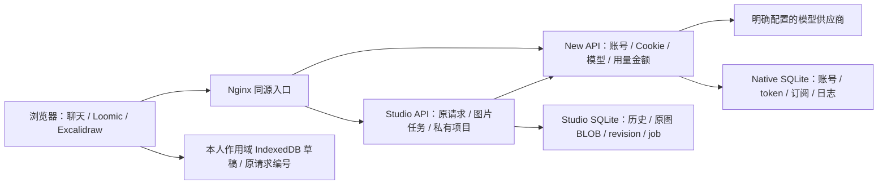

# 本地系统交付与继续开发

2026-10-02，交付分支 `codex/system-integration`，工作树 `C:/Users/56161/.codex/worktrees/system-integration/gouo-canvas`。应用实现截至 `3c69835`，整栈及隔离浏览器配置截至 `ad3f844`；后续状态文档提交不修改应用实现。UI799ad3b已整合进来，原工作区 `codex/registration-trial` 和日常8080没有自动替换，不需要访问原chat才能接手。

## 已打通的系统



New API是唯一账号、金额和网关权威。Studio使用真实本人身份处理业务，没有另造账户/钱包；access token只在浏览器内存，refresh为HttpOnly Cookie，供应商/relay凭据留服务器。原旧One Hub的src/server未动。

- 默认首页可直接输入，首次明确发送才创建真实会话；创建返回meta，历史GET才带runs，二者分型。选择失权保原意图并拒绝，不静默换模型或资金。
- 默认聊天和Agent有真实SSE文本/工具/终态，离线或Stop只结束接收；已有成果保留，恢复读取原结果。Loomic Agent原编号先IDB提交再POST，保存失败零发送，换户/迟到结果/删图都有守卫。
- Loomic直接图片入口在actual目录批准jobs时使用202，模式/原UUID/参数先保存。关页后同API进程继续，重开/上线只GET原任务。原raw在首次解码前暂存，得到原图后仅本地完成保存；未提交重启需本人授权，提交未知不重发。默认全实例活跃2、每owner活跃操作1，没有独立Worker或持久账号Bearer。
- 原图BLOB/hash、本人asset、私有项目CAS/revision和幂等from-asset可保存重开。冲突/断网/保存拒绝停止覆盖，当前文档及原图可导出。费用显示Native本人request ID/时间，recorded不等于已证明实扣，unknown held不释放、不假称退款。
- 三画布入口可建原生电商版式：方形1024、竖1200×1600、横1600×900或100–4096整数自定义，标题/价格/卖点/品牌分别编辑。商品复制原file/bytes及几何，源元素不动；选定未旋转frame按当前像素尺寸白底PNG导出。没有图片时明确空版式。长文案/极扁尺寸需原生调整，没有Logo素材库/自动排版/批量管理完成声明。
- 合成验收实例的Native＋Studio配对冷备份/空目标恢复已实际通过，原账号归属/PNG/revision2/failed/unknownheld精确保留，源停止、只目标可写。工具不启动服务/调用模型/改资金；适用条件见BACKUP-RESTORE。

## 启动和复验

从本工作树仓库根执行：

```powershell
$env:npm_config_cache = Join-Path (Get-Location) 'v2/.local/npm-cache'
$env:npm_config_logs_dir = Join-Path (Get-Location) 'v2/.local/npm-logs'
node v2/scripts/setup.mjs
Set-Location v2
npm run check
npx playwright install chromium
npm run test:e2e:isolated -- --workers=1 --reporter=line
npm run test:stack
```

隔离浏览器套件使用自己5187、reusefalse、未匹配API指向拒绝端口，不启动业务API或连接日常服务；全是明确F。stack另开随机临时项目，真实固定未初始化Native边界和明确假New API合同分阶段，产物独立目录，结束仅回收本次临时栈。实际Native有真实普通账户/资金/本地供应商的opt-in runner，不进入默认check/CI；要求先人工准备同本地合成实例和显式隔离确认。真实P不能自动运行。

下方默认Compose名为`gouo-v2`、端口8080；**只有不存在该项目/数据卷且8080空闲的干净机器可直接执行**。当前用户机器已有日常项目，不能用这条命令更新它。需要在本机新开实例时，选择独立`-p`项目名、空闲端口和匹配的origin，见RUNNING。干净机器从仓库根执行：

```powershell
docker compose --env-file v2/deploy/.env.example -f v2/deploy/compose.yml up --build --wait
```

入口 `http://localhost:8080/studio/`。示例generation/trial/renewal/jobs默认关闭，无供应商凭据也能启动/编辑/检查；账号初始化、正式渠道、价格和授权文件遵循RUNNING/MODEL_SETUP等手册。不要在原已存在日常实例上直接执行本次更新；当前分支没有替用户升级其数据或服务。

本轮临时可查看入口是 `http://127.0.0.1:60169/studio/`，明确本地合成supplier/采购0，不是实际AI商品图效果或公开部署。该目标保留演练数据，源仍冷停止；本地端口可用性随操作者关闭Docker而变化。合成账号manifest、密码和备份不在本页提供或提交。

## 证据与下一任务

应用3c69835的最终`npm run check`为110领域/205API/类型/build12.42秒exit0；配置ad3f844的隔离全量浏览器单worker **206/206，5.3分钟**，三阶段stack exit0（真实未初始化Native边界、明确New API double 2/2 12.4秒、fixture资金普通账号闭环1/1 4.7秒）。Native runner设施40/40、1.540秒；实际普通Native首次首页发送/reload6.972秒及图片202关页连续恢复9.1706秒通过，均本地合成供应商。真实dist游客商品导入、原生640×480版式、PNG/文档导出重开，初始11/11和fresh当前构建8/8通过。F、实际Native、本地合成商品和P分别记录，不把这些计数相加。

首次stack会话meta/detail崩溃已修复，第二次stack输出与PW冲突已隔离；原失败保留。隔离双worker第一次205/206中的分页显示失败未查明，独立12次定向与最终单worker206/206都通过，没有修改断言或超时；后续复现需失败DOM/HTTP/trace证据。完整原始日志索引见STATUS顶部。

完整实际命令、原失败及计数在 [STATUS.md](STATUS.md) / [SYSTEM-INTEGRATION-STATUS.md](SYSTEM-INTEGRATION-STATUS.md)。原28扩展验收只把B5新补齐的核心升级，19通过/9partial，N16/9、P13未验；不能把206浏览器或205API数加到这28场景，也不声称最终版本重新执行全部28项。按新系统阶段与商业扩展边界分别交接。

下一公开启用任务 **G1→G2→P**：具体HTTPS/Origin/共享限流/会话配置、Native资金修正与请求级实扣证据、明确渠道/版本/参数/预算的真实模型测试。商户支付/SMTP/MFA及生产加密备份/容量/保留另门；独立后台授权 **B3-II** 完成后再做 **B3-III** Worker。月度订阅、视频、Logo素材库和批处理是后续产品范围。

实际测试曾因对live bind的dist原位build，使旧标签页缺旧hash动态chunk；原失败保留，fresh最终bundle验证另算。准备部署时需使用完整版本目录切换，并保留旧hash资产供旧页面加载，避免在服务中的dist直接clean/build。游客未登录的目录401目前有偏技术的不可用提示，后续UI文案可改善；这不代表有真实生成授权。

阅读顺序：START_HERE_V2→TASKS当前段→SYSTEM-INTEGRATION-PLAN当前进度→STATUS顶部，再按具体任务读API-DATA、B3-JOBS、BACKUP-RESTORE、QA_ACCEPTANCE_REPORT。历史段落的“下一”不能覆盖当前状态。
